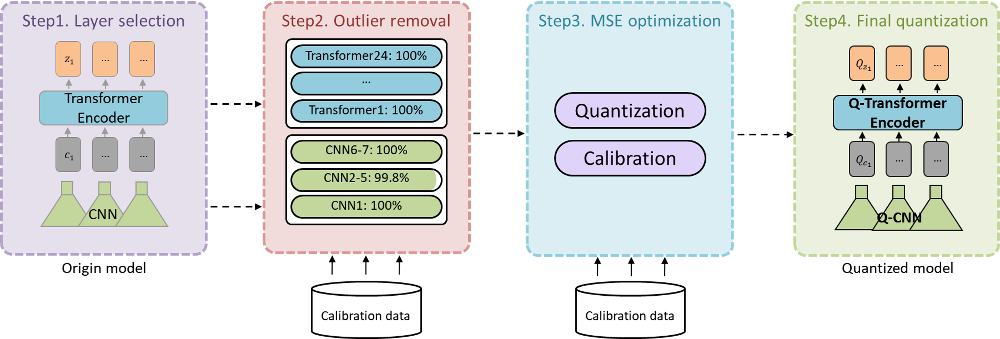

# StableQuant (ICASSP 2025)
- StableQuant is a novel layer-adaptive post-training quantization method for speech foundation models, achieving robust compression and fast inference without additional fine-tuning by optimally calibrating each layer based on its characteristics.
## Workflow

- Step1: Layer selection <br>
Apply layer-wise quantization using MAX calibration to the original model
Identify layers showing an ASR performance degradation above the threshold
Dropping over 0.25 % in terms of WER
- Step2: Outlier removal  <br>
Remove outliers from the identified layers through percentile-clipping of the histogram
Search optimal cut-off percentile layer by layer
- Step3: MSE optimization <br>
Compute the optimal scaling factor by minimizing the mean squared quantization error
- Step4: Final quantization <br>
Quantize the original model based on the computed scaling factor and the clipped histogram

## 0. Prerequisties
- We recommend using an NVIDIA RTX 3090 Ti GPU
- Our implementation is based on CUDA 12.1
```
git clone https://github.com/Yeona-Hong/StableQuant.git
```
## 1. Data Setup
- We use LibriSpeech 'dev-clean' set for quantization and 'test-clean' set for evaluation.
- Make sure to update the dataset path in tsv/test-clean.tsv as shown below:

```
yeona@speecht5:~/StableQuant/tsv$ head -5 test.tsv 

/data/yeonahong/LibriSpeech/test-clean # Modify this path
5142/36377/5142-36377-0014.flac 406640
5142/36377/5142-36377-0011.flac 34641
5142/36377/5142-36377-0025.flac 190160
5142/36377/5142-36377-0001.flac 86240
```

## 2. Environmental Setup
### 
- Set up the Docker environment by mounting the necessary folders as specified in below.
```
# Run docker container
docker run --gpus all -it -v "/home/yeona/StableQuant:/home/yeona/StableQuant" -v "/data/yeonahong:/data/yeonahong" nvcr.io/nvidia/tensorrt:24.03-py3
cd /home/yeona/StableQuant

bash setup.sh
```

## 3. Inference
```
cd /home/yeona/StableQuant
python test_engine.py
```
### Results (example)
```
root@containername:/home/yeona/StableQuant# python test_engine.py
2025-04-19 06:52:02 | INFO | fairseq.tasks.text_to_speech | Please install tensorboardX: pip install tensorboardX
[04/19/2025-06:52:03] [TRT] [I] Loaded engine size: 356 MiB
[04/19/2025-06:52:03] [TRT] [W] Using an engine plan file across different models of devices is not recommended and is likely to affect performance or even cause errors.
[04/19/2025-06:52:03] [TRT] [I] [MemUsageChange] TensorRT-managed allocation in engine deserialization: CPU +0, GPU +351, now: CPU 0, GPU 351 (MiB)
[04/19/2025-06:52:03] [TRT] [I] [MemUsageChange] TensorRT-managed allocation in IExecutionContext creation: CPU +0, GPU +2071, now: CPU 0, GPU 2422 (MiB)

Running Inference...
2620it [00:40, 65.15it/s]
Word Error Rate (WER): 2.36
```

## Contacts
For any inquiries regarding this project, please contact:
```
Yeona Hong: yeona.hong@samsung.com
Hyewon Han: hwhan@dsp.yonsei.ac.kr
Woo-jin Chung: woojinchung@dsp.yonsei.ac.kr
```
## Citation
If you find this code useful, please consider citing our paper below.
```
@INPROCEEDINGS{icassp2025stablequant,
  author={Hong, Yeona and Han, Hyewon and Chung, Woo-Jin and Kang, Hong-Goo},
  booktitle={IEEE International Conference on Acoustics, Speech and Signal Processing (ICASSP)}, 
  title={StableQuant: Layer Adaptive Post-Training Quantization for Speech Foundation Models}, 
  year={2025},
  pages={1-5},
  doi={10.1109/ICASSP49660.2025.10888735}}
```

